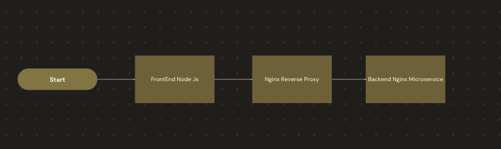

Compliance Agent – PDF Merger Web App

Compliance Agent is a full-stack web application built to streamline document handling in the mortgage industry. It enables mortgage agents and administrators to upload, decrypt, rearrange, and merge PDF documents in compliance with regulatory requirements.

🚀 Features

Drag-and-drop PDF uploads
Section-wise document grouping
Decryption and secure PDF previewing
Merge functionality with optional Stripe integration
Production-ready reverse proxy via NGINX
🛠️ Tech Stack

Frontend: React.js (Node.js v20.19.2)
Backend: Spring Boot v3.4.5
PDF Handling: Apache PDFBox
File Transfer: Axios, RESTful APIs
Authentication / Payments (Optional): OAuth 2.0, Stripe
Reverse Proxy: NGINX
📁 Folder Structure
```
compliance-agent/
├── backend/                        # Spring Boot backend
│   └── PdfMerger/
│       └── src/main/java/com/complianceagent/Pdf/Merger/
├── frontend/                      # React frontend
│   └── compliance-app/
│       └── src/components/
├── nginx/                         # NGINX reverse proxy config
│   └── PdfMerger/
│       └── .platform/nginx/conf.d/client_max_body_size.conf
├── docker-compose.yml             # Local Docker setup
├── docker-compose.prod.yaml       # Production Docker setup
└── README.md
```
⚙️ Running the App Without Docker (Manual)

Backend
cd PdfMerger
./mvnw spring-boot:run
Make sure port 8080 is available.
Frontend
cd compliance-app
npm install
npm start
The app runs at: http://localhost:3000
🧱 System Architecture

Frontend (React) – Handles UI, file uploads, drag-and-drop interface, and PDF previews.
Backend (Spring Boot) – Handles secure decryption and PDF merging using Apache PDFBox.
NGINX – Serves as a reverse proxy and static asset server for production deployment.
🔮 Future Improvements

✅ Add user authentication using OAuth 2.0
💳 Stripe integration for paid document processing
📜 Version history for uploaded files
🪵 Advanced logging and error monitoring (e.g., Sentry or ELK stack)
=======
# Compliance Agent – PDF Merger Web App

The **Compliance Agent** application is a full-stack web solution built to streamline document handling in the mortgage industry. It enables mortgage agents and admins to upload, decrypt, rearrange, and merge PDF documents to meet compliance standards.

The platform consists of a React frontend, a Spring Boot backend, and an NGINX reverse proxy for production deployments. It supports drag-and-drop upload zones, document previewing, and secure server-side processing.

---
## Folder Structure 
compliance-agent/
├── backend/ # Spring Boot backend service
│ └── PdfMerger/
│ └── src/main/java/com/complianceagent/Pdf/Merger/
│
├── frontend/ # React frontend application
│ └── compliance-app/
│ └── src/components/
│
├── nginx/ # NGINX reverse proxy config
│ └── PdfMerger/
│ └── .platform/nginx/conf.d/client_max_body_size.conf
│
├── docker-compose.yml # Local Docker setup
├── docker-compose.prod.yaml # Production Docker setup
└── README.md

## Technologies Used

- **Frontend:** React.js (Node v20.19.2)
- **Backend:** Spring Boot v3.4.5
- **PDF Handling:** Apache PDFBox
- **File Transfer:** Axios, RESTful APIs
- **Authentication/Payments (optional):** Stripe, OAuth (TBD)
- **Reverse Proxy:** NGINX

---
## Running With Docker

### Dev Environment
Does not support hot reload
```
docker compose up -d
```
### Prod Environment
```
docker compose -f docker-compose.prod.yaml up -d
```

## Running Without Docker (Manual)

  ### Backend
  cd PdfMerger
  ./mvnw spring-boot:run
  Ensure port 8080 is free.

  ### Frontend
  cd compliance-app
  npm install
  npm start
  Runs on http://localhost:3000

## System Architecture
Frontend (React) – Handles UI, PDF preview, drag-and-drop
Backend (Spring Boot) – Processes and decrypts PDFs, merges documents
NGINX – Reverse proxy and static file delivery



## Future Improvements
Add user authentication (OAuth 2.0)
Integrate Stripe for document-based payments
Add version history for uploaded documents
Enhanced error logging and monitoring


---
